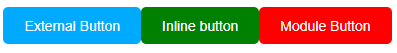

# CSS Styles
In this prcatise project, I explored three different ways to apply CSS in a React application. I focused on styling buttons using:

1. External CSS
2. Inline CSS
3. CSS Modules

I rendered two button components in a single *App.jsx* file, each styled differently to show the strengths of each approach.

## How I Did the Project
1. I created a *Button* component in React.
2. I first styled it using a regular **external CSS file** (*index.css*).
3. Then, I added a second button in the same component and applied **inline styles** directly inside JSX.
4. I created a new component inside a *Button/* folder and styled it using **CSS Modules**.
5. I used *App.jsx* to render both button components for comparison.

## Project Structure
```javascript
src/
├── App.jsx               // Main entry component that renders both buttons
├── index.css             // Global CSS used for external styling
├── Button.jsx            // Contains one component using external + inline styles
├── Button/               // Folder for the component using CSS Modules
│   ├── Button.jsx        // Module-styled button component
│   └── Button.module.css // CSS Module file for scoped styles
```

#### 1. *App.jsx*
In *App.jsx*, I imported both *Button* and *Button2*, then rendered them.
```javascript
import Button from './Button.jsx';
import Button2 from './Button/Button.jsx'

function App() {

    return(
        <>
            <Button></Button>
            <Button2></Button2>
        </>
    );
}

export default App
```
### 2. External CSS and Inline CSS (*Button.jsx*)
In this component, I demonstrated two different styles:
- **External CSS**: I styled the first button by assigning it a className ("*button*") defined in the *index.css* file.
- **Inline CSS**: I styled the second button using a styles object directly in JSX, without using a *className*.

#### Button.jsx
```javascript
function Button(){
    
    const styles = {
    backgroundColor: 'green',
    color: 'white',
    padding: '10px 20px',
    borderRadius: '5px',
    border: 'none',
    cursor: 'pointer',
    }

    return(
        <>
            <button type="button" className="button">External Button</button>
            <button type="button" style={styles}>Inline button</button>
        </>
    );
}

export default Button
```

#### index.css
I created this file to define the external style for the first button.
```css
.button{
    background-color: hsla(200, 100%, 50%);
    color: white;
    padding: 10px 20px;
    border-radius: 5px;
    border: none;
    cursor: pointer;
}
```

### 3. CSS Modules (*Button/Button.jsx*)
I used *CSS Modules* to locally scope styles. Instead of using a global *className*, I imported a CSS module file and applied the class using *styles.button*.
#### *Button.jsx*
```javascript
import styles from './Button.module.css';

function Button2(){
    
    return(
       <button type="button" className={styles.button}>Module Button</button>
    );
}

export default Button2
```

#### *Button.module.css*
```css
.button{
    background-color: rgb(255, 0, 0);
    color: white;
    padding: 10px 20px;
    border-radius: 5px;
    border: none;
    cursor: pointer;
}
```
## Screenshot


## What I Learnt
This practise project helped me practice different styling methods in React:
- **External CSS** can lead to naming conflicts especially when there are many components and classes to work with. Therefore, a strong naming convention is required and good organization.
- **Inline styles** are useful for quick, component-scoped styles without class names. It is easy convenient and easy to understand and prevents Global conflicts because class names are not needed. However, inline styling can be increasingly become less maintainable in large applications and reduces the readability of the components especially when there is alot of CSS properties. Hence it is better when used for components with minimal styling.
- **CSS Modules** offer scoped styling to prevent conflicts, making them great for large apps.

Each method has its own use case, and now I feel more confident choosing the right one depending on the situation.