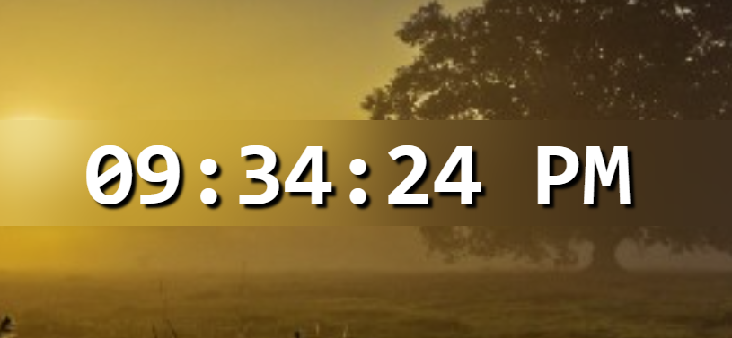

# ReactJS Digital Clock

This project is a Digital Clock built with React, and I created it as part of my learning journey to solidify my understanding of *useState* and *useEffect* hooks particularly focusing on:

- How to run a function only once when the component mounts (i.e., on first render), and
- How to manage time-based updates using *setInterval* in React.

## Features of the ReactJS Digital Clock
- Real-time digital clock that updates every second
- 12-hour format with AM/PM indicator
- Leading zeros for single-digit hours, minutes, and seconds
- Clean and minimal React functional component

## ReactJS Digital Clock Code
```jsx
import React, {useState, useEffect} from "react";

function DigitalClock(){

    const [time, setTime] = useState(new Date());

    useEffect(() => {

        const intervalId = setInterval(() => {
            setTime(new Date())
        }, 1000);

        return () => {
            clearInterval(intervalId);
        }
    }, []);

    function formatTime(){
        let hours = time.getHours();
        const minutes = time.getMinutes();
        const seconds = time.getSeconds();
        const meridiem = hours > 12 ? "PM" : "AM";
        
        hours = hours % 12 || 12;

        return `${padZero(hours)}:${padZero(minutes)}:${padZero(seconds)} ${meridiem}`
    }

    function padZero(number){
        return (number < 10 ? "0" : "") + number
    }

    return(
        <div className="digitalClock">
            <div className="clock"><span>{formatTime()}</span></div>  
        </div>
    )
}

export default DigitalClock
```

### Code Explanation: How the Digital Clock Works
**1. Importing React and Hooks**
- I imported React along with two important hooks:
     - *useState* to store the current time.
     - *useEffect* to run some code only once when the component is mounted (first render).

```js
import React, { useState, useEffect } from "react";
```

**2. Component Definition & Initial State**
- I created a functional component named *DigitalClock*.
- I used *useState(new Date())* to set the initial value of *time* to the current time using JavaScript's *Date()* object.
- time will hold the current time, and I’ll update it every second using *setTime*.

```js
function DigitalClock() {
    const [time, setTime] = useState(new Date());
}
```

**3. Setting Up the Clock with useEffect**
- *setInterval()* runs a function every second, updating the time state.
- The cleanup function using clearInterval() prevents memory leaks when the component unmounts.

```js
    useEffect(() => {
        const intervalId = setInterval(() => {
            setTime(new Date()); // updates the time every 1 second
        }, 1000);

        return () => {
            clearInterval(intervalId); // clears interval when component unmounts
        };
    }, []);
```

**4. Formatting the Time for Display**
- I Grabbed the hours, minutes, and seconds from the current time.

```js
    function formatTime() {
        let hours = time.getHours();
        const minutes = time.getMinutes();
        const seconds = time.getSeconds();
        const meridiem = hours >= 12 ? "PM" : "AM";

        hours = hours % 12 || 12;

        return `${padZero(hours)}:${padZero(minutes)}:${padZero(seconds)} ${meridiem}`;
    }
```

- I Converted the time from 24-hour format to 12-hour format using:
```js
hours = hours % 12 || 12;
```
e.g., 13 becomes 1, 0 becomes 12.  
Determined whether it’s "AM" or "PM".

Used a helper function *padZero()* to make sure single-digit numbers (like 5) show as 05.

**5. Padding Function for Leading Zeros**
```js
    function padZero(number) {
        return (number < 10 ? "0" : "") + number;
    }
```

This adds a 0 before any number less than 10.

For example, 8 becomes "08".

**6. Rendering the Clock**
- I rendered a `<div>` containing the formatted time using {formatTime()}.
- The time updates every second thanks to the setInterval() logic inside useEffect.
```js
    return (
        <div className="digitalClock">
            <div className="clock">
                <span>{formatTime()}</span>
            </div>
        </div>
    );
```

## Screenshot



## What I Learnt
Through this project, I learnt:
- How to initialize state with the current date using *useState(new Date())*
- How to run code only once on component mount using *useEffect(() => {...}, [])*
- How to use *setInterval* and clear it properly to avoid memory leaks
- How to manipulate and format time values in JavaScript
- How to conditionally format hours for 12-hour format with AM/PM